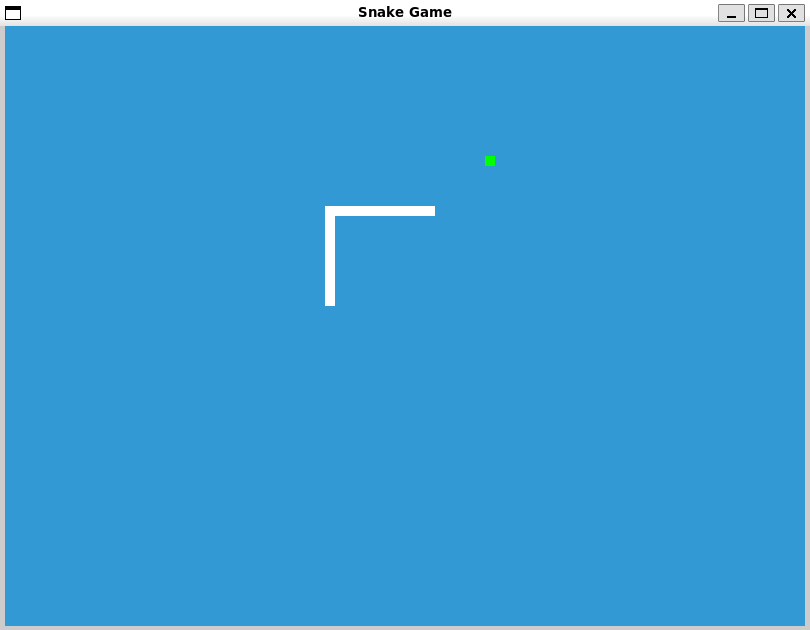

# Snake Game in Python
Classic Snake Game built in Python using the PyGame library.

## How to play
- Use the arrow keys to move the snake.
- Eat the food to grow the snake.
- Don't hit the walls or the snake's body.

## How to run
1. Clone the repository
```bash
git clone
```

2. Install the dependencies
```bash
pip install -r requirements.txt
```

3. Run the game
```bash
python snake.py
```

## Screenshot
